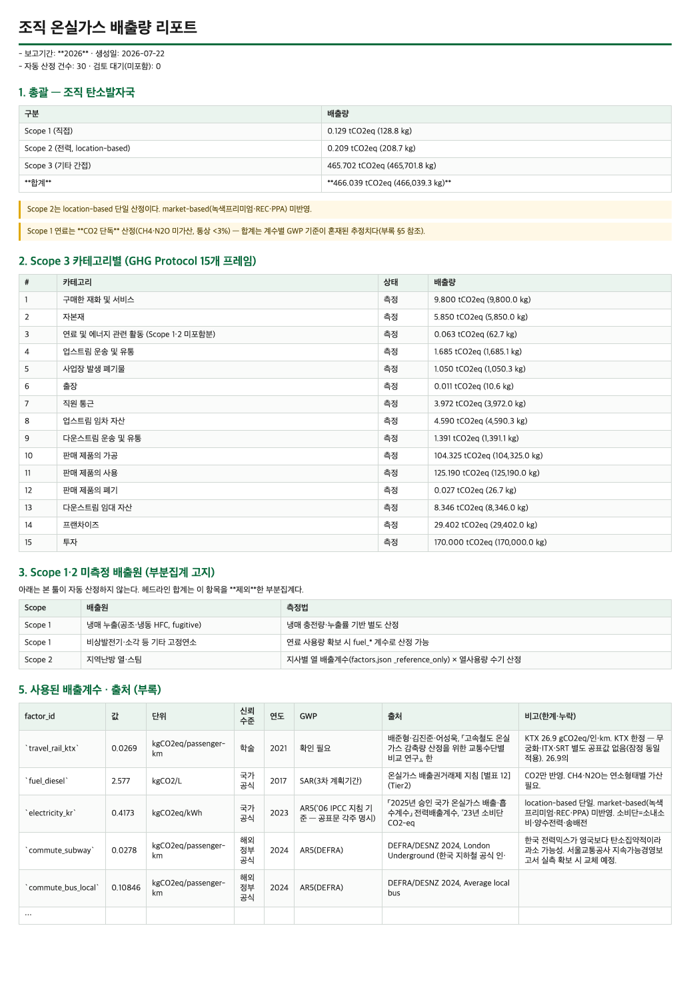

# carbonledger

[](https://github.com/dillettante/carbonledger/actions/workflows/test.yml)
[](LICENSE)
[](pyproject.toml)

**영수증·고지서 등 기초자료를 LLM으로 읽어 조직 온실가스 배출량(Scope 1·2·3)과 탄소발자국을 자동 산정하는 CLI.** (한국 증빙·계수 특화)

기초자료를 폴더에 넣고 한 번 실행하면 → 비전 LLM이 활동량(연료 L·전력 kWh·이동 구간 등)을 뽑고 → 검증 관문을 통과한 것만 배출계수를 곱해 → **조직 탄소발자국 리포트(md·xlsx)** 로 집계한다.

LLM은 **Claude·ChatGPT 등(상용)** 또는 **LM Studio, Ollama 등(로컬)** 중 선택 — 기밀 증빙이면 로컬 백엔드를 쓰면 이미지가 외부로 나가지 않는다.

### 나오는 것



*모든 수치에 계수 출처·연도·GWP기준·신뢰수준·한계가 따라붙는다 — 감사·검증 시 "이 숫자가 어디서 왔나"를 되짚을 수 있게. (전체 샘플: [`examples/sample_output/`](examples/sample_output))*

### 다른 방법과 뭐가 다른가

| | 무료 계산기(수기 입력) | 탄소회계 SaaS | **carbonledger** |
|---|---|---|---|
| 입력 | 사람이 숫자 전사 | 사람 입력 또는 연동 | **AI가 증빙에서 추출** |
| 기밀 증빙 | — | 업체 서버 전송 | **로컬 LLM이면 유출 없음** |
| 계수 출처 | 대개 비공개 | 대개 비공개 | **전량 공개·리포트에 자동 부록** |
| 오추출 방어 | — | — | **검증 관문 + 검토 큐(fail-closed)** |
| 비용 | 무료 | 유료 구독 | 무료(오픈소스) |

> ⚠️ **먼저 읽을 것** — 산출물은 **추정치**다. 배출권거래제·목표관리제 명세서 등 규제 신고 자료가 아니다. 거리기반·지출기반 산정은 명세서 방법론과 다르고, 일부 계수는 해외정부공식·학술·사용자입력 등급이다. 신고 전 소관기관(gir.go.kr / 한국환경공단)의 확정계수로 재검증할 것. (계수별 출처·신뢰수준은 리포트 부록과 `carbonledger/data/factors.json`에 명시.)

---

## 무엇을 산정하나

| Scope | 대상 | 입력 | 방법 |
|---|---|---|---|
| **1** 직접배출 | 법인차·시설 연료(휘발유·경유·도시가스) | `scope1-fuel/` 영수증·고지서 이미지 | 연료량 × 국가 고유 배출계수(gir 별표12) |
| **2** 간접-전력 | 전기 | `scope2-energy/` 한전 고지서 이미지 | kWh × 국가 전력배출계수(location-based) |
| **3** 기타 간접 | **GHG Protocol 15개 카테고리 전부** | 카테고리별 입력(아래 표) | 활동량 × 배출계수 |

**Scope 3의 카테고리별 입력** — 데이터 소스는 제각각이지만 계산은 전부 `활동량 × 배출계수`로 같다:

| 카테고리 | 입력 | 방법 |
|---|---|---|
| 6 출장 (KTX·항공·버스·숙박) | `travel/` 승차권·영수증 이미지 | AI 추출 → 거리·박수 × 인·km(박) 계수 |
| 7 통근 | `commute.csv` 설문 | 거리 × 수단별 계수 |
| 1 구매 재화·서비스 | `spend.csv` 지출 내역 | 지출액 × **사용자 입력 계수** |
| 3 연료·에너지 관련 | **입력 없음** | Scope 1·2 산정치에서 자동 파생(WTT·송배전손실) |
| 15 투자 | `scope3/cat15_*.csv` | PCAF 귀속공식(잔액/기업가치 × 피투자 배출) |
| 2·4·5·8~14 (자본재·운송·폐기물·임차/임대·가공·사용·폐기·프랜차이즈) | `scope3/cat{N}_*.csv` | 통일 CSV 한 벌: 활동량+단위+계수(레지스트리 또는 사용자 입력) |

**자동화 농도는 카테고리마다 다르다** — 6·7·1·3은 증빙 AI추출/설문/파생으로 손이 거의 안 가고, 2·4·5·8~15는 **사용자가 활동량 CSV를 준비**하면 계수 적용·검증·감사추적·집계를 툴이 맡는다(계수 선택과 단위 검증이 실무의 실제 난점이라 이 부분이 값을 한다). 넣은 카테고리만 산정되고, 안 넣은 카테고리는 리포트에 "미측정"+측정법 안내로 표시된다. CSV 열 정의·작성법은 [PLAYBOOK.md](PLAYBOOK.md)에.

**Scope 귀속은 폴더가 선언한다.** 같은 주유 영수증도 법인차면 Scope 1, 개인차 출장이면 Scope 3-6, 통근이면 3-7이다 — AI가 추측하지 않는다. 어느 폴더에 넣을지는 [`carbonledger/data/boundary.md`](carbonledger/data/boundary.md)의 조직경계 안내를 따른다.

## 설치

```bash
git clone https://github.com/dillettante/carbonledger.git && cd carbonledger
pip install -e .          # requests + openpyxl
# (선택) 고지서 PDF를 다룬다면: pip install -e ".[pdf]"   # pymupdf(AGPL)
```

**비전 LLM 준비** (증빙 이미지 추출용) — 셋 중 하나:

| 백엔드 | 설정 | 특징 |
|---|---|---|
| **Claude** | `CARBONLEDGER_BACKEND=anthropic` + `ANTHROPIC_API_KEY` | 정확도 높음. ⚠️ 증빙 이미지가 Anthropic으로 전송 |
| **ChatGPT** | `CARBONLEDGER_BACKEND=openai` + `OPENAI_API_KEY` | 정확도 높음. ⚠️ 증빙 이미지가 OpenAI로 전송 |
| **로컬(LM Studio)** | 기본값. [LM Studio](https://lmstudio.ai) 설치 후 `qwen/qwen3-vl-4b` 로드 | **증빙이 외부로 안 나감** — 기밀·개인정보 증빙에 권장 |
| **로컬(Ollama)** | `CARBONLEDGER_BACKEND=ollama` + `ollama pull qwen3-vl:4b` | 증빙이 외부로 안 나감. 터미널 사용자용 |

```bash
# 예: Claude로 쓰기
export CARBONLEDGER_BACKEND=anthropic
export ANTHROPIC_API_KEY="sk-ant-..."
```
모델은 `--model`로 바꿀 수 있다(미지정 시 백엔드별 기본: qwen3-vl-4b / gpt-4o / claude-sonnet-5).
**증빙에 개인정보·영업비밀이 있으면 로컬 백엔드를 쓰라** — 상용 백엔드는 이미지가 제공자 서버로 나간다.

**거리 API 키** (출장 산정용, 선택) — Kakao 또는 Naver:
```bash
export KAKAO_REST_API_KEY="..."                  # developers.kakao.com (우선 사용)
# 또는
export NAVER_MAP_CLIENT_ID="..."                 # console.ncloud.com Maps
export NAVER_MAP_CLIENT_SECRET="..."
```
주요 철도역은 좌표가 내장돼 키 없이도 산정된다. 내장에 없는 역·기타 지명만 지도 API를 쓰고, 키가 없으면 그 건은 review 큐로 간다(조용히 빠지지 않음). 지명(출발·도착)만 전송된다.

## 사용

```bash
# 입력 폴더 구조
input/
├── scope1-fuel/       # 법인차·시설 연료 영수증·고지서
├── scope2-energy/     # 전기 고지서
├── travel/            # 출장 승차권·항공권·숙박 영수증
├── commute.csv        # 통근 설문
└── spend.csv          # 구매 지출(사용자 계수 포함)

# 실행 (보고기간 지정 권장 — 그 해의 발자국만 집계)
carbonledger run input/ --period 2026 --out out/

# 검토 대기 조회 + 교정본 병합 재집계
carbonledger review out/

# 네트워크 없이 전 모듈 검증
carbonledger selftest
```

바로 해볼 수 있는 예제가 [`examples/input/`](examples/input)에 있다(**전부 합성 문서** — KTX 승차권·한전 고지서·통근/지출 CSV. 원본 HTML은 `examples/fixtures_src_*.html`). 렌더된 샘플 리포트는 [`examples/sample_output/`](examples/sample_output)에서 미리 볼 수 있다:
```bash
carbonledger run examples/input --period 2026 --out examples/out
```
철도 거리는 내장 역좌표로 산정되므로 이 예제는 **Kakao 키 없이도** 출장 배출량까지 나온다.

### CSV 형식 (요약 — 상세는 [PLAYBOOK.md](PLAYBOOK.md) §1)

- **commute.csv** (통근): `employee_id,mode,factor_id,oneway_km,workdays` — factor_id는 통근 수단 5종 중 하나.
- **spend.csv** (구매): `item,krw,factor,factor_source` — 한국 공개 지출계수표 부재로 **계수·출처를 직접 입력**(출처 없으면 review 큐).
- **scope3/cat{N}_*.csv** (나머지 카테고리 2·4·5·8~14): 통일 스키마 `item,activity,unit,factor_id,factor,factor_source` — 레지스트리 계수(freight·waste 등) 또는 사용자 계수.
- **scope3/cat15_*.csv** (투자): PCAF 공식 — `asset,asset_class,outstanding,denominator,investee_emissions`.
- **카테고리 3**(연료·에너지 관련)은 입력 없음 — Scope 1·2에서 자동 파생.

작성 예시는 [`examples/input/`](examples/input)에 카테고리별로 있다. 열 정의·단위 규칙·주의사항 전체는 **[PLAYBOOK.md](PLAYBOOK.md)** 가 유일한 상세 원본이다.

## 검증 — AI가 뽑은 값을 그냥 믿지 않는다

싼 관문 → 강한 관문 순으로 걸러 **통과 못한 것만 사람이 본다**(human-in-the-loop).

| 관문 | 하는 일 |
|---|---|
| 형식·스키마 | 날짜꼴·금액 양수·필수 필드 |
| 마스터데이터 대조 | 추출 역명이 실제 역 목록에 있나(오독 적발) |
| 폴더-유형 일치 | 폴더가 선언한 Scope와 문서유형이 어긋나나(오분류 적발, fail-closed) |
| 교차 산술 | 주유량×단가≈금액 / 금액÷kWh 단가 상식범위(30~2000원) / 지침 역전·지침차>사용량 적발(고압 배율 허용) |
| 보고기간 | 기간 밖·날짜 결측은 집계 제외(fail-closed) |

미통과 건은 `out/records.json`의 review_queue와 리포트 §검토 대기에 "**미포함**"으로 명시된다. 교정 후 `carbonledger review`로 되돌린다.

**표본 감사 5%** 는 코드가 아니라 운영 절차다 — 규제·공시용이라면 무작위 표본을 사람이 정답 대조해 "정확도 N%로 검증된 방법론"이라는 수치를 확보하는 것이 감사·분쟁 시 방어선이다.

## 배출계수의 정직성

공개 배포 툴의 신뢰성은 "이 숫자가 어디서 왔나"를 추적할 수 있느냐다. 모든 배출량 레코드는 `factor_id`를 달고 다니고, 리포트는 사용된 계수를 **값·단위·출처·연도·GWP기준·신뢰수준·한계**로 자동 부록화한다.

- 신뢰수준: `국가공식`(gir 고시) > `해외정부공식`(DEFRA, OGL v3) > `학술`(KCI) > `사용자입력`
- **알려진 한계를 숨기지 않는다**: 연료계수는 CO2만 반영(CH4·N2O 별도 가산 필요), 전력 WTT/T&D는 UK 프록시, 직선거리 근사(철도·버스 ×1.2 우회보정) 등이 리포트 부록·비고에 그대로 표기된다.
- 국가 전력배출계수(0.4173)는 **gir 공표 원문 PDF 대조 완료**(2026-07-20, GWP=AR5) — 검증 이력도 factors.json에 남긴다.
- 계수 조사 근거 전량은 [`PHASE0_RESEARCH.md`](PHASE0_RESEARCH.md)에.

## 한계 (알고 쓰라)

- **거리는 대권거리 근사** — 철도·버스는 ×1.2 우회보정, 항공은 DEFRA 계수의 8% uplift 내장(그래서 항공엔 거리보정 미적용). 실노선거리보다 부정확할 수 있다. 철도는 내장 역좌표로 오프라인 산정하고, 미등재 역·기타 수단은 지도 API(Kakao 권장, Naver 폴백 — Naver Geocoding은 주소 지향이라 지명 검색 미실측)로 좌표를 얻는다.
- **상용 LLM 백엔드는 실호출 미검증** — 개발 검증은 로컬(LM Studio)로 수행. 상용(Claude·ChatGPT)은 표준 API 규격 구현이며 첫 실행 전 소액 테스트를 권장. 상용 사용 시 증빙 이미지(직원·거래처 개인정보 포함 가능)가 해외 제공자로 전송되므로 **개인정보보호법상 국외이전·처리위탁 검토가 필요할 수 있다**.
- **Scope 2는 location-based 단일** — market-based(녹색프리미엄·REC·PPA) 미지원.
- **부분집계** — Scope 1 냉매 누출·비상발전, Scope 2 지역난방 열·스팀은 자동 산정하지 않는다(리포트에 미측정으로 명시).
- **고지서 추출은 문서 품질에 좌우** — 합성·고화질 샘플에선 정확하나, 흐린 스캔·저화질에선 오류가 난다. 그래서 검증 관문과 표본 감사가 필수다.
- **비전 LLM 추출의 대량 처리** — 수만 장 규모면 YOLO+경량 LLM 방식이 비용상 유리하다(본 툴은 비전 LLM 단독 = 수십~수백 장 규모에 적합).

## 구조

```
carbonledger/
├── cli.py        # run / selftest / review — 폴더 일괄 처리
├── extract.py    # 비전 LLM 추출(로컬/OpenAI/Anthropic) + DOC_SPECS + PDF→이미지 렌더
├── validate.py   # 검증 관문
├── factors.py    # 배출계수 레지스트리 로더(단위 검사)
├── calc.py       # Scope별 산정 + 거리
├── scope3.py     # Scope 3 카테고리 2~15 통일 CSV 어댑터 + cat3 파생 + cat15 PCAF
├── report.py     # md·xlsx·records.json
└── data/         # factors.json · stations.json · categories.json · boundary.md
```

라이선스: Apache 2.0. 배출계수 출처·라이선스(DEFRA OGL v3 등)는 [`NOTICE`](NOTICE) 참조.

---
*본 리포트·산출물은 법률·규제 자문이 아니며, 규제 신고 전 소관기관 확정계수로 재검증해야 한다.*
